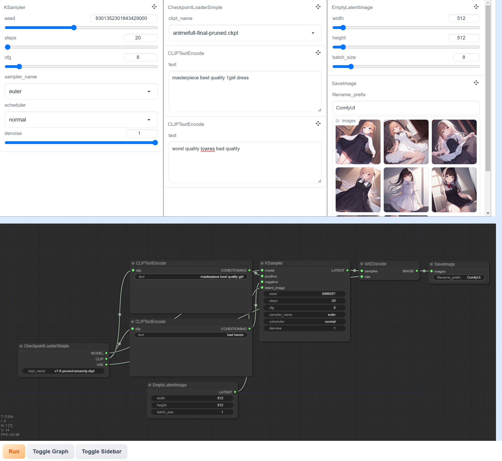
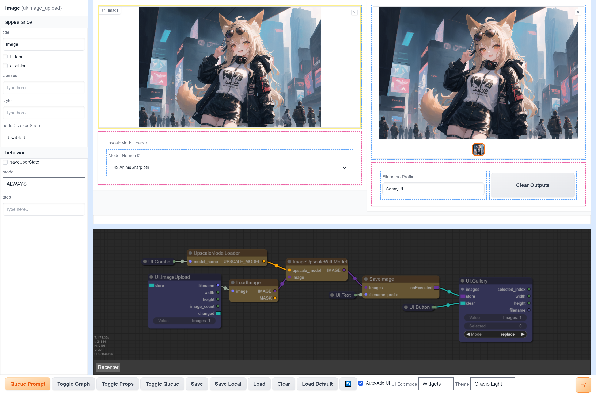

# ComfyBox

ComfyBox is a frontend to Stable Diffusion that lets you create custom image generation interfaces without any code. It uses [ComfyUI](https://github.com/comfyanonymous/ComfyUI) under the hood for maximum power and extensibility.





## Installation

1. Download the latest release [here](https://nightly.link/space-nuko/ComfyBox/workflows/build-and-publish/master/ComfyBox-dist) and extract it somewhere.
2. Start the ComfyUI backend with `python main.py --enable-cors-header`.
3. In the folder you extracted open the `run.bat`/`run.sh` script (requires Python 3 to be on your PATH). Alternatively you can serve the contents of the folder with any web server.

## NOTE

This project is *still under construction* and some features are missing, be aware of the tradeoffs if you're interested in using it.

This frontend isn't compatible with regular ComfyUI's workflow format since extra metadata is saved like panel layout, so you'll have to spend a bit of time recreating them. This project also isn't compatible with regular ComfyUI's frontend extension format, but useful extensions can be integrated into the base repo with some effort.

## Features
- *No-Code UI Builder* - A novel system for creating your own Stable Diffusion user interfaces from the basic components.
- *Extension Support* - All custom ComfyUI nodes are supported out of the box.
- *Prompt Queue* - Queue up multiple prompts without waiting for them to finish first. Inspect currently queued and executed prompts.
- *Prompt History* - Browse through previously generated prompts and their output images/parameters.

## Development

### Requirements

- `pnpm`
- An installation of vanilla [ComfyUI](https://github.com/comfyanonymous/ComfyUI) for the backend

### Installation

1. Clone the repo with submodules:

```
git clone https://github.com/space-nuko/ComfyBox --recursive
```

2. `pnpm install`
4. `pnpm build:css`
5. `pnpm dev`
6. Start ComfyUI with `python main.py --enable-cors-header`
7. Visit `http://localhost:3000` in your browser
